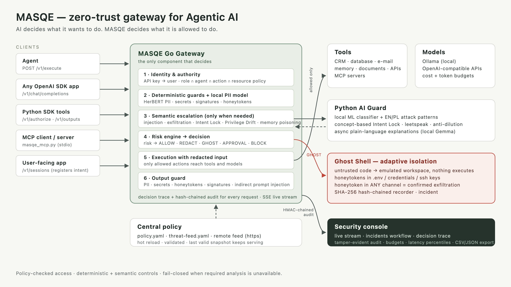

# MASQE — zero-trust runtime security gateway for Agentic AI

> **AI decides what it wants to do. MASQE decides what it is allowed to do.**

MASQE sits between users, agents and everything an agent can touch: LLMs
(local or commercial), tools, databases, e-mail, memory, documents, MCP
servers and code. The agent proposes an action; MASQE verifies identity,
authority, the user's goal, content, behaviour and budget, runs the action only
when permitted, and inspects the result before it returns to the agent.
Decisions: `ALLOW`, `REDACT`, `GHOST`, `REQUIRE_APPROVAL`, `THROTTLE`, `BLOCK`.

**What is in the box**

| | |
| --- | --- |
| Control layer | Go gateway (`/v1/execute`), OpenAI-compatible proxy (`/v1/chat/completions`), Python SDK wrapper for your own tools, MCP stdio proxy |
| Hybrid defense | deterministic guards (identity, RBAC, resource policy, PII, secrets, 26 exploit signatures, budgets) + AI guards (injection, exfiltration, Intent Lock, Privilege Drift, memory poisoning, indirect injection in outputs) |
| Adaptive isolation | **Ghost Shell**: untrusted code runs in an emulated workspace with honeytokens; any attempt to move them is a confirmed incident, in any channel |
| Central policy | one commented `policies/policy.yaml` + `threat-feed.yaml` (+ optional remote feed), hot reload, invalid edits never fail open |
| Reporting | real-time console (live event stream, incidents workflow, decision trace, budgets, latency percentiles), **tamper-evident audit log** (HMAC hash chain, verified in the console), CSV/JSON audit export |
| Self-testing | `make test` — positive and negative tests across Go, Python, the demo agent, and end-to-end flows against the real services |

This is a hackathon prototype: the demo tools use isolated SQLite fixtures and
a mock outbox; models run locally via Ollama or through any OpenAI-compatible
API; Ghost Shell is data-level isolation (an emulator), not an OS sandbox.

## Architecture



Editable vector source: [`docs/architecture.svg`](docs/architecture.svg).

* **Go decides, Python scores.** The AI Guard returns bounded scores; only the
  gateway issues decisions. If it is unavailable, requests that need semantic
  analysis **fail closed**; short low-risk requests skip the semantic classifier.
* **Performance telemetry.** `/v1/telemetry` and each decision trace report
  latency percentiles and separate gateway, semantic, and PII-model timings.
  The PII detector's cache stores spans/offsets, not the text itself. The test
  suite checks a gateway-overhead budget on its local end-to-end path; timings
  vary by machine, model availability, and whether a result is cached, so the
  dashboard's live values are the appropriate runtime measurement.
* **Explanations never slow decisions.** Plain-language explanations (local
  Gemma) are generated asynchronously after the verdict and attached to the
  audit event; the engine's technical reasons stay authoritative.
* **Need-to-know reporting.** Detector scores, thresholds, signature IDs and
  regexes are visible only to the security role (`decision.details`,
  `policy.read_full`), so nobody can tune an attack just below a threshold.
* **Tamper-evident audit.** Every write to an audit record or incident status
  appends an entry to an append-only chain in the same transaction: SHA-256 of
  the record's new state, linked to the previous entry with HMAC-SHA256. The
  key lives outside the database (`MASQE_AUDIT_KEY`, else a `0600` file
  `data/masqe.db.audit-key` created on first start). `GET /v1/audit/verify`
  and the **Events** page catch a decision rewritten in SQLite, a deleted or
  inserted row, a forged or removed chain entry and a truncated tail. If the
  gateway later writes to a row someone edited (an async explanation, say), it
  records the edit permanently before re-sealing, so a later write can't
  launder it. The chain head goes to the startup log, the CSV export
  (`X-MASQE-Audit-Chain-Head`) and the JSON export (`integrity`). Limits: this
  detects tampering but can't prevent it. Anyone holding both the database and
  the key can rewrite history; anchoring the head outside the host closes that.

## Getting started

Clone the repository, then run the commands below from its root directory:

```bash
git clone https://github.com/OskarBartoszyk/MASQE-HackYeah2026.git
cd MASQE-HackYeah2026
```

### Option A — Docker (fastest, any OS)

Needs only [Docker Desktop](https://www.docker.com/products/docker-desktop/).

```bash
docker compose up --build
```

Run the command from the repository root, then open **http://127.0.0.1:8080**
(published on loopback only, because the sample API keys are public). Stop with
`Ctrl+C`; `docker compose down -v` also deletes the stored audit log and Ghost
Shell recordings.

The first build downloads CPU-only PyTorch and attempts to bake the Polish
HerBERT PII model into the AI Guard image. It is a large download; later builds
are cached. For a lighter image with rule-based redaction only:

```bash
MASQE_INSTALL_NER=false docker compose up --build
```

### Option B — run from source (macOS / Linux / Windows via WSL2)

**1. Install the prerequisites**

| Tool | Version | Check | Notes |
| --- | --- | --- | --- |
| Git | any | `git --version` | |
| Go | 1.23+ | `go version` | <https://go.dev/dl/> |
| Python | 3.10+ | `python3 --version` | Debian/Ubuntu also need `sudo apt install python3-venv` |
| Node.js | 20+ | `node --version` | <https://nodejs.org/> |
| C compiler | any | `cc --version` | SQLite driver uses cgo. macOS: `xcode-select --install`; Debian/Ubuntu: `sudo apt install build-essential` |
| make | any | `make --version` | preinstalled on macOS/Linux; on Windows use WSL2 |
| Ollama | optional | `ollama --version` | for live local-model replies and AI explanations: `ollama pull gemma3:4b` |

The demo and test suite do not require a paid API key. Installing dependencies
or downloading the optional PII model requires network access; after setup, the
gateway and tests run locally. Ollama is optional for live model-generated
replies and explanations.

**PII model:** `make setup` attempts to download the fine-tuned Polish HerBERT model
[`OskarBartoszyk/PLVeilBest`](https://huggingface.co/OskarBartoszyk/PLVeilBest)
(about 500 MB) from Hugging Face. When available, inference then runs locally;
prompt text is not sent to Hugging Face. If the model cannot be installed or
loaded, redaction follows the configured rule-only fallback or block behavior.

**2. Set up the project (one time)**

```bash
make setup        # Python dependencies/model attempt, dashboard build, Go modules
```

**3. Start**

```bash
make run          # AI Guard on :8090, gateway + dashboard on :8080
```

Keep this terminal open; stop with `Ctrl+C`. Then open
**http://127.0.0.1:8080**. The gateway listens on loopback only, because the
sample API keys below are public.

**4. Verify the installation**

```bash
make test         # full suite; prints a PASS/FAIL line for each test
```

### Demo accounts

The console starts in **demo mode** as `secops-demo-key` (security team).
Switch identity with **Acting as** in the demo bar; outside demo mode, paste
a key in the sidebar. Keys are defined in
`policies/policy.yaml` — replace them before any use outside a demo.

| API key | User / role | Good for |
| --- | --- | --- |
| `demo-key` | alice / analyst | everyday requests |
| `viewer-demo-key` | vicky / viewer | read-only role |
| `support-demo-key` | bob / support | e-mail, agent memory |
| `developer-demo-key` | dev / developer | external API, memory |
| `admin-demo-key` | admin / admin | destructive actions (need a second approver) |
| `secops-demo-key` | secops / security | full audit log, CSV/JSON export, approvals |

### Things to try

```bash
# Sample agent (second terminal, gateway must be running)
python3 demo-agent/agent.py --action reports.read "Summarize the Q4 report"
python3 demo-agent/agent.py --autonomous "Summarize the Q4 report"      # needs Ollama
python3 demo-agent/agent.py --action customer.delete --key admin-demo-key \
  --resource customer/123 --intent "Delete demo customer 123" "Delete demo customer 123"
```

- Console → **Playground** (demo mode): eight scenarios or your own prompt.
- Turn on **Employee traffic generator** to see normal background traffic.
- Edit `policies/policy.yaml` (e.g. `mode: strict` → `mode: permissive`) or
  append a signature to `policies/threat-feed.yaml` — the next request uses it,
  no restart.
- `make tamper-demo` plays an insider: it rewrites the newest `BLOCK` to `ALLOW`
  directly in SQLite, and **Events** turns red with the exact record.
  `make tamper-demo UNDO=1` restores it.
- `make reset-data` clears the audit log, its chain and budgets for a clean demo.

### Troubleshooting

| Symptom | Fix |
| --- | --- |
| `address already in use` | Port 8080 or 8090 is taken: `lsof -ti tcp:8080 \| xargs kill` (same for 8090), or set `MASQE_ADDR=127.0.0.1:9080`. |
| `No module named 'sklearn'` | Run `make setup`, or `.venv/bin/pip install -r ai-guard/requirements.txt`. |
| `cgo: C compiler "gcc" not found` | Install a C compiler (see prerequisites). |
| Top bar says the AI layer is unavailable and most requests are blocked | The AI Guard is not running — start with `make run`, not `go run` alone. This fail-closed behaviour is intended. |
| Red banner "configuration rejected" | Your last YAML edit is invalid; the banner shows the error. The previous policy keeps working until you fix the file. |
| AI explanation shows "unavailable" | Ollama is not running or `gemma3:4b` is not pulled. Decisions are unaffected. |
| Blank dashboard | Rebuild it: `cd dashboard && npm ci && npm run build`. |


## Integrating MASQE (agent → model, agent → tool, agent → MCP, app → agent)

**1. Any OpenAI-compatible client — change one line.**

```python
from openai import OpenAI
client = OpenAI(base_url="http://127.0.0.1:8080/v1", api_key="demo-key")
client.chat.completions.create(model="gemma3:4b", messages=[{"role": "user", "content": "Summarize the Q4 report"}])
```

Every call passes identity, the model allowlist, budgets, PII/secret redaction,
injection and output controls. Blocks come back as OpenAI-style errors
(`403 masqe_policy_violation`, `429` for throttling) plus a `masqe` object with
the request id. Optional headers: `X-MASQE-Agent`, `X-MASQE-Session`,
`X-MASQE-Intent`. `GET /v1/models` lists the allowed models.

**2. Commercial APIs with real budgets.** A provider of `kind: openai` points
to any OpenAI-compatible endpoint (OpenAI, Azure, vLLM, LM Studio…). The key is
read from an environment variable, never from the policy; actual token usage
is reconciled and billed with `cost_per_1k_tokens` against the same
per-model/user/agent budgets as local models. See `model_providers` in
`policies/policy.yaml`.

**3. Your own tools — Python SDK** (`sdk/python/masqe_sdk.py`, standard library only):

```python
from masqe_sdk import Masqe
masqe = Masqe("http://127.0.0.1:8080", "demo-key")
masqe.open_session("Answer the support ticket of customer 123")   # Intent Lock

@masqe.tool("customer.read", resource="customer/{customer_id}")
def get_customer(customer_id):
    return crm.fetch(customer_id)          # runs in your process
```

The decorator asks MASQE first (`/v1/authorize`) and sends the result to the
output guard (`/v1/outputs`); blocked calls raise `MasqeBlocked`, and personal
data in the result comes back redacted. Authorizations are single-use and
bound to the caller.

**4. MCP** (`sdk/python/masqe_mcp.py`, stdio): either expose the guarded MASQE
tools to any MCP client, or proxy an existing MCP server — every `tools/call`
is authorized and its output inspected; unmapped tools are refused.

```bash
python3 sdk/python/masqe_mcp.py --key demo-key                                   # built-in tools
python3 sdk/python/masqe_mcp.py --key demo-key --map search=documents.read -- python3 my_server.py
```

**5. App → agent.** A user-facing application can register the user's goal
(`POST /v1/sessions`) and pass the resulting session id to the agent. Setting
`sessions.require_registered: true` makes this mandatory and prevents an agent
from replacing the registered intent. The shipped demo policy leaves this
option `false` so direct demo/API requests work without first opening a session.

## The security console

The dashboard (served at `/`) is an operations console, not a test form:

* **Operations** — six clickable KPIs, a **live decision stream** (Server-Sent
  Events; pause/resume), the open-incident queue, approvals waiting for a second
  person, security posture with its components, a decision timeline, triggered
  controls and signatures, budgets and latency percentiles. One time range
  (15 min / 1 h / 24 h / 7 days) drives every view.
* **Incidents** — one queue for gateway detections (signatures, honeytokens,
  indirect injection, memory poisoning) and Ghost Shell incidents, with an
  analyst workflow (open → in progress → resolved, notes) for the security role.
* **Events** — audit explorer with search and filters; every row opens a
  drawer with the **decision trace** (each check, score vs threshold, timing),
  reasons and the AI explanation. Deep link: `#/events?event=<request_id>`.
  For the security role, an **integrity banner** re-verifies the audit chain
  every 30 s and links each violated record.
* **Ghost Shell**, **Agents & resources** (effective-permission matrix, budgets,
  costs, performance), **Policy** (active controls, resource rules, feed).
* **Demo mode** (toggle in the sidebar) adds the identity switcher, a
  background **traffic generator** of ordinary employees, the **Playground**
  scenarios and a self-checking **jury checklist**. Turn it off and the same
  console is the product view.

## Ghost Shell — adaptive isolation with honeytokens

When an agent is asked to work on untrusted code, `repository.analyze` on an
`untrusted/*` resource returns `GHOST` and MASQE **opens a Ghost Shell session
automatically** (`ghost_shell_session` in the response). The agent keeps
working through `shell.exec`, but every command runs in a deterministic Python
emulator with a synthetic repository — never a host shell, interpreter,
package manager or socket. Sessions can also be opened manually from the
console.

* **Honeytokens.** `.env`, `~/.aws/credentials` and `~/.ssh/id_rsa` contain
  synthetic credentials unique to the session. Reading them is a signal;
  sending them anywhere is a **confirmed exfiltration attempt**
  (`confirmed_exfiltration_attempt`), captured inside the emulator — nothing
  leaves. The gateway knows every live honeytoken: if one appears in **any
  other channel** (a prompt, an e-mail, an API call, a tool output) the request
  is blocked and the originating session gets a `canary_used_outside_ghost`
  incident. Literal, URL-encoded and base64 forms are detected.
* **Agent sees a shell, the audit sees the attack.** Commands such as
  `curl … | bash` run in the emulator, but the gateway still matches them
  against the threat feed: the audit event is relabelled `GHOST` with the
  signature IDs and the honeytoken hit, so reporting and incidents show it.
* **Recorder.** Commands, outputs, outbound payloads and marker hits are kept
  in a SHA-256 hash chain (`data/ghost.db`, 72 h retention). README-to-upload
  attribution is labelled as a correlated sequence, not proof of intent.
* **Boundaries.** Real-looking secrets or personal data typed into the shell
  are refused with an audited `BLOCK` (only the session's own honeytokens may
  pass, so exfiltration can be observed). Touching another user's session is
  refused with `403` and audited. `shell.exec` has a high base risk (0.45);
  permissions, `ghost.enabled`, budgets and step limits are re-checked on every
  command. Commands: `ls [-a]`, `cat`, `cd`, `pwd`, `whoami`, `env`, `echo`,
  literal `grep [-i]`, `git status`, `base64`, simulated `curl`, `wget`, `nc`,
  `pip install`; pipes, `;`, `&&`. Everything else is reported as unsupported.
* **Agent and explanations.** In demo mode, *Replay attack scenario* replays
  six fixed commands (clearly labelled), while *Next agent step* lets the
  local `gemma3:4b` choose the next command — it may recognise the injection
  and refuse. A local model can explain a session on demand; failures are
  reported, never replaced with canned text.
* `make run` generates a shared ephemeral `MASQE_INTERNAL_KEY` for the
  gateway ↔ AI Guard channel; set your own in Docker. `make reset-data` clears
  the gateway database only, not `data/ghost.db`.

## Test suite and how to run it

```bash
make test         # full suite: Go + Python + demo agent + end-to-end
make test-unit    # Go + Python + demo agent unit/integration tests
make test-e2e     # end-to-end tests only
```

The suite reports its current test count when it runs; the count changes as
coverage grows. It needs the dependencies installed by `make setup`, but no
paid API key or external LLM service. It has both positive cases (permitted
actions, safe prompts, redaction, approvals, and consistent virtual files) and
negative cases (unauthorized actions, PII/secrets, injection, resource/budget
violations, and attempted exfiltration).

| Test layer | What it checks | Command |
| --- | --- | --- |
| Go unit and integration | Policy/guard decisions, identity and permissions, budgets, execution, API behavior, audit integrity, telemetry, hot-reload logic | `make test-unit` or `go test ./...` |
| Python AI Guard | English/Polish semantic detection, Intent Lock, explanation failure handling, NER offsets/fallback, Ghost Shell consistency, canaries, and recorder integrity | `make test-unit` or `.venv/bin/python -m unittest discover -s ai-guard -p 'test_*.py' -v` |
| Demo agent | Agent plan → gateway-authorized tool call → response, including blocked-plan behavior | `make test-unit` or `.venv/bin/python -m unittest discover -s demo-agent -p 'test_*.py' -v` |
| End to end | Starts the real Go gateway and Python AI Guard on temporary local ports with disposable policy/database files; exercises HTTP, hot policy/feed reload, invalid configuration recovery, dashboard APIs, OpenAI-compatible proxy, SDK, MCP, Ghost Shell, performance telemetry, and fail-closed behavior | `make test-e2e` |

The end-to-end tests include user-like/ad-hoc attack prompts, verify both
allowed and denied outcomes, and alter a temporary policy and threat feed while
the services are running. `make test` runs all layers and prints individual
PASS/FAIL results plus a final summary. Tests do not use the production/demo
database or mutate the checked-in policy files.

Coverage note: the default suite tests the PII-model interface, offset handling,
caching, and configured fallback using test doubles; it does not download or
benchmark the optional HerBERT checkpoint itself. The dashboard has no separate
browser-automation suite; its production bundle is validated with
`cd dashboard && npm run build`, while end-to-end tests exercise the APIs that
provide its data.

## Live jury flow

1. **Operations**: posture, live stream, incidents, budgets, latency (switch the
   time range at the top). Turn on the traffic generator in the demo bar.
2. **Playground**: eight scenarios or any custom prompt; open the event to see
   the decision trace.
3. As *Admin* delete a customer; as *SecOps* approve it on **Operations**.
   Self-approval and replay are rejected.
4. Edit `policies/policy.yaml` (`mode: strict → permissive`, `threshold: 0.5`,
   `enabled: false`, a role's permissions). The next request follows it; a
   broken edit shows a red banner and the previous policy keeps serving.
5. Append a signature to `policies/threat-feed.yaml` and send matching text.
6. **Ghost Shell** → *Replay attack scenario*, then **Incidents** to triage.
7. **Events** → filter and export CSV/JSON (security role). The jury
   checklist in the demo bar ticks itself off as you go.
8. `make tamper-demo` in a second terminal: the integrity banner on **Events**
   turns red and names the rewritten record; `make tamper-demo UNDO=1`.

## API

| Endpoint | Purpose |
| --- | --- |
| `GET /health` | public liveness, config hash, `config_error`, `semantic_degraded` |
| `POST /v1/sessions` | register the user's intent; returns a gateway-issued `session_id` |
| `POST /v1/execute` | enforced built-in action with guarded output |
| `POST /v1/evaluate` | dry-run verdict (no step counted, no approval opened) |
| `POST /v1/chat/completions`, `GET /v1/models` | OpenAI-compatible proxy |
| `POST /v1/authorize`, `POST /v1/outputs` | SDK: authorize a local tool, then guard its output (single use) |
| `GET /v1/approvals`, `POST /v1/approvals/{id}/approve` | two-person approval |
| `GET /v1/telemetry?range=15m\|1h\|24h\|7d` | management + performance metrics |
| `GET /v1/stream` | live audit events (Server-Sent Events, role-scoped) |
| `GET /v1/incidents`, `POST /v1/incidents/{id}/status` | unified incident queue and workflow |
| `GET /v1/audit`, `GET /v1/events/{id}` | security events (own or all, by role) |
| `GET /v1/audit/export.csv`, `.json` | exportable audit (`audit.export`), with the chain head |
| `GET /v1/audit/verify` | recompute the tamper-evident audit chain (`audit.read_all`) |
| `GET /v1/policy` | effective policy (thresholds and regexes for `policy.read_full` only) |
| `/v1/ghost/sessions…` | Ghost Shell sessions, recorder, explanations |

Everything except `/health` requires an API key; reporting endpoints also need
the role's `console` permission.

## Central policy

`policies/policy.yaml` is the single, fully commented source for keys, roles
(agent permissions and console access), agents, models and providers,
strictness profiles, guardrail actions and thresholds, budgets and budget
alert bands, per-user/agent/model limits, resource rules, sessions, Ghost
Session, and the optional remote threat feed. Effective authority is
**user ∩ agent ∩ action ∩ resource policy**: an agent never has more authority
than the user who runs it.

* Thresholds come from the active `strictness_modes` profile; an explicit
  `threshold` on a control overrides only that control.
* `enabled: false` removes a control and its share of the aggregate risk.
* Every value is validated (actions, 0–1 ranges, risk ordering, roles, agents,
  local model URLs, regexes). An invalid edit never fails open.

## Controls

| Layer | Controls |
| --- | --- |
| Deterministic | API-key identity, RBAC, agent permissions, resource policy, model allowlist, budgets (tokens, cost, rate, steps, tool calls, runtime, session rotation), PII (PESEL, NIP, ID card, IBAN, card, e-mail, phone; checksums), secrets (API keys, JWT, AWS/GitHub/Slack/Google tokens, private keys, passwords, connection strings, base64-hidden), 26 historical-exploit signatures, Unicode canonicalisation (zero-width, full-width, homoglyphs) |
| Semantic | prompt injection and data exfiltration (local ML classifier + EN/PL patterns, chunked against dilution, leetspeak decoding), concept-based cross-lingual **Intent Lock**, **Privilege Drift** (per session and across sessions), memory poisoning, indirect injection in tool output |
| Adaptive | risk tiers → **Ghost Session** / **Ghost Shell** with honeytokens → human approval → block |
| Output | PII/secret redaction or blocking, honeytokens, exploit signatures and indirect injection in every tool, model and SDK-tool result |

## Threat-model alignment (OWASP Agentic AI)

| Threat | MASQE control |
| --- | --- |
| Goal hijacking / indirect injection | Semantic Guard, Intent Lock with registered sessions, output guard |
| Tool misuse / excessive agency | user ∩ agent ∩ resource permissions, Ghost Session, approvals |
| Identity and privilege abuse | key-bound identity, no client-granted permissions, cross-session Privilege Drift |
| Sensitive information disclosure | input and output redaction, secret blocking, CSV-safe export |
| Memory poisoning | `memory.write` permission + memory-poisoning detector + output guard on `memory.read` |
| Unexpected code execution / supply chain | hot-reloaded and remote signature feed (pickle, torch.load, trust_remote_code, Log4Shell, ShadowRay, SSRF, …); untrusted code only in Ghost Shell |
| Data exfiltration by a compromised agent or insider | honeytokens tracked across all channels, confirmed incidents with hash-chained evidence |
| Unbounded consumption / runaway agents | per-scope budgets with WARN/THROTTLE bands, steps, tool calls, runtime, session-rotation limit |
| Cascading failures | fail-closed semantic layer, last-valid-policy snapshot, bounded async explainer |

The table is a control mapping, not a claim of certification.

## Security review fixes

Two red-team passes found and fixed:

* **First pass:** session-id rotation resetting runaway and drift limits; raw
  PII reaching tools when a decision escalated above REDACT; typos in policy
  actions silently disabling controls; viewers draining shared budgets with
  denied or forged-usage requests; injection paraphrases skipping the semantic
  layer; lexical Intent Lock (bypass by stuffing the goal's words, false blocks
  across languages); missing detectors (AWS/GitHub keys, private keys,
  `wget|sh`, `os.system`, unsafe YAML/joblib, base64, zero-width characters);
  CSV formula injection; audit readable by every role; LLM explanation time
  counted as gateway latency; broken YAML taking the gateway offline;
  `max_steps` above 21 never firing; thresholds in `security:` ignored; disabled
  controls still blocking; threat-feed `action` ignored.
* **Second pass (Ghost Shell and reporting):** honeytokens pasted inline into a
  shell command were rejected instead of recorded (the incident was missed);
  honeytokens leaving through e-mail/API/prompts were not recognised; attacks in
  the shell appeared as `ALLOW` with no signatures in reporting; the posture
  score stayed 100/100 with open critical incidents; detector scores,
  thresholds and signature regexes were readable by every role (an oracle for
  tuning attacks); foreign Ghost sessions returned `500` without an audit trail;
  `shell.exec` had the lowest risk in the system; an SDK authorization could be
  consumed by another user.

Each has a regression test (`gateway/security_test.go`,
`gateway/ghost_security_test.go`, `gateway/integration_test.go`,
`ai-guard/test_*.py`, `tests/e2e_test.py`).

## Privacy and model note

Audit records exclude prompt content and detected values; personal data in
resource names is masked. They store actor, action, resource, decision,
reasons, triggered controls, policy version, scores, usage and latency.

The semantic classifier is a small offline model (TF-IDF + logistic
regression) trained at start-up from English and Polish examples, combined
with explicit patterns. It is a demonstrator, not a benchmarked production
detector. Personal data is detected by the fine-tuned Polish HerBERT model
(PLVeil, run locally by the AI Guard) together with checksum-validated rules;
`redaction.on_model_failure` decides whether a missing model falls back to rules
or blocks.

