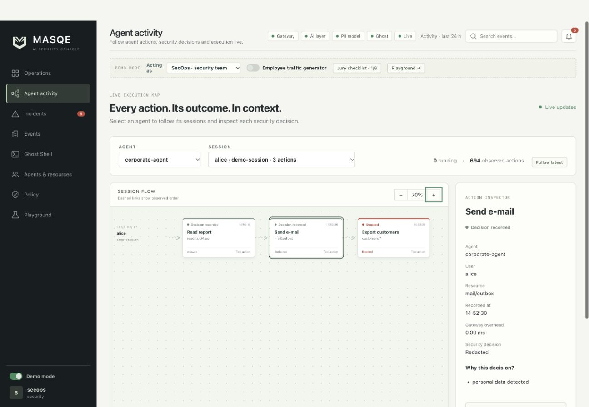
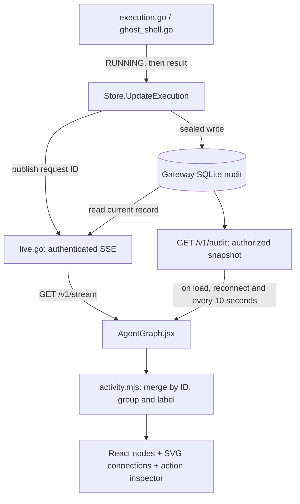

# Agent activity

The **Agent activity** tab at `/#/activity` turns gateway audit records into a
live session graph. Each node represents one observed request. A node's security
decision and execution status are displayed separately: an allowed request may
still be waiting for a tool result, and a completed operation may have its output
withheld.



## Using the view

1. Open the running console at `http://127.0.0.1:8080/#/activity`.
2. Select an agent with activity in the last 24 hours. The agent list comes from
   the audit records visible to your signed-in identity.
3. Select a session, or show the eight most recent sessions together. Each lane
   is scoped to its user, agent and session ID.
4. Use **Follow latest** to keep the newest visible action in view. Drag the
   canvas to pan; use the zoom buttons to change scale or reset to 100%.
5. Select an action to inspect its resource, timestamp, gateway overhead,
   decision, reasons and controls. **Open full event** opens the existing event
   drawer; Ghost session actions also offer **Open Ghost Shell**.

Selecting a node or dragging the canvas disables automatic following. Turn
**Follow latest** back on to resume. The view uses its own 24-hour window and
live subscription; pausing the Operations stream does not pause this graph.

For connected steps, reuse the same `session_id` for the agent's requests. The
graph separates identical session IDs owned by different users. Requests without
a session ID are displayed as individual lanes. The existing employee traffic
generator can be used to populate the view with live demo requests.

## What the statuses mean

| Graph label | Recorded state | Meaning |
| --- | --- | --- |
| Running | `RUNNING` | The gateway entered its execution path; a final result has not been received by the view. |
| Completed | `EXECUTED` | The operation completed and its output was released. |
| Emulated | `EXECUTED` with decision `GHOST` or action `shell.exec` | The recorded execution used a Ghost path. Shell commands ran in the emulator. |
| Awaiting approval | `PENDING_APPROVAL` | The recorded request is waiting for approval. |
| Awaiting tool result | `AUTHORIZED_EXTERNAL` | The SDK/MCP caller received authorization; completion awaits its output report. |
| Output withheld | `EXECUTED_OUTPUT_BLOCKED` | The operation ran, but output controls withheld its result. |
| Stopped / Throttled | Block, rejection or non-execution state | The recorded operation did not complete through the allowed execution path. |
| Decision recorded | Other states, including `VERDICT_ONLY` | A decision is available without evidence of completed execution. |
| Execution unconfirmed | `RUNNING`, audit timestamp older than two minutes | The view no longer presents the old record as a confirmed current operation. This does not cancel the request. |

Status labels summarize the most recent audit record received. The two-minute
threshold is measured from the record's original timestamp, not a dedicated
execution heartbeat. Short operations can finish before their intermediate
`RUNNING` state is displayed. Ghost emulation may be shown as running while the
internal request is pending, then as emulated once complete.

## Data flow



The graph uses the existing audit API and stream with a Bearer key in the request
header. The server applies ownership and role-based disclosure rules. No extra
graph service, graph database or Workflow runtime is required. Presentation is
inspired by [Workflow](https://github.com/OskarBartoszyk/Workflow).

The client updates an existing node when another event with the same request ID
arrives. Snapshot reconciliation recovers current records after a disconnect;
events arriving during a snapshot fetch are merged over that response. The SSE
feed publishes current record state rather than replaying every intermediate
execution transition. Snapshot recovery is bounded by the view's record limit.

## Scope and limits

- The view keeps up to 1,000 recent records from the last 24 hours.
- It displays up to eight recent session lanes, with the latest 40 actions per
  lane. Use the session selector to inspect another loaded session.
- Dashed connections indicate recorded chronological order. MASQE does not
  currently record parent-task dependencies, so the graph does not infer a task
  dependency tree or prove that linked actions ran sequentially.
- Selection, pan, zoom and graph data live in browser memory. Reloading rebuilds
  the view from the authorized audit snapshot.
- The view only sees requests and results reported to MASQE. Unreported work
  inside an external agent or tool is not observable here.

## Applying the update

For a local source deployment, rebuild the assets from the repository root:

```bash
npm --prefix dashboard run build
```

Restart the gateway using its existing environment and launch method, then
reload the browser. If you use `make run`, stop that development launcher and
start it again with `make run`. The updated Go process is needed to publish
`RUNNING`; replacing only the browser assets does not update the backend.

For a Compose deployment:

```bash
docker compose up --build -d
```

No new application settings or database schema are required. Execution status
uses the existing `audit_events.execution_status` field and sealed update path.

## Checks and source files

Run from the repository root:

```bash
node --test dashboard/src/activity.test.mjs
go test ./gateway -run TestExecutionPublishesRunningBeforeProviderCall
npm --prefix dashboard run build
```

The graph tests cover status interpretation, user/session separation, ordering,
updates by request ID and the time window. The Go regression test checks that
the audit is marked running before model dispatch and leaves that state after
both a successful response and a provider error. The Node tests are separate
from the current `make test` runner.

| File | Responsibility |
| --- | --- |
| `dashboard/src/App.jsx` | Navigation, route and page mounting keyed to API identity |
| `dashboard/src/pages/AgentGraph.jsx` | Snapshot/stream lifecycle, selectors, graph and inspector |
| `dashboard/src/activity.mjs` | Status mapping, grouping, sorting and event merging |
| `dashboard/src/activity.test.mjs` | Graph data tests using the Node test runner |
| `dashboard/agent-graph.css` | Canvas, cards, states, responsive layout and reduced-motion support |
| `dashboard/src/lib.js` | Shared API/stream helpers and Running label |
| `gateway/execution.go` | Execution transition before dispatch |
| `gateway/ghost_shell.go` | Execution transition before emulated shell dispatch |
| `gateway/store.go`, `gateway/live.go` | Sealed audit update, publication and authorized SSE delivery |

[Back to README](../README.md#the-security-console) · [Developer architecture](developer-architecture.md)
