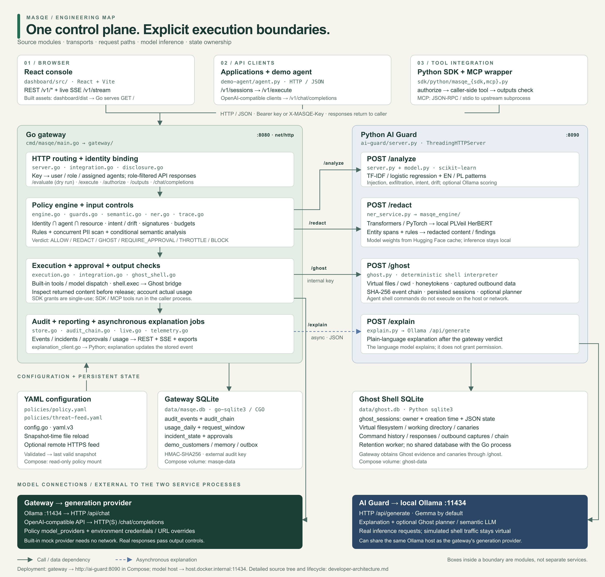

# MASQE — developer architecture

This guide maps the implementation, not a proposed future deployment. The two
backend processes are a Go gateway and a Python AI Guard. React is built into
static assets served by the gateway. Ollama or an OpenAI-compatible provider
supplies generation when selected by configuration.



[Full-resolution JPG](developer-architecture.jpg) · [Zoomable SVG source](developer-architecture.svg) · [Setup and tests](../README.md#getting-started)

## Process and technology boundaries

| Process / component | Entry point | Technology | Responsibility |
| --- | --- | --- | --- |
| Gateway | `cmd/masqe/main.go` | Go, `net/http`, `yaml.v3`, `go-sqlite3` through CGO | Authenticated API, policy decisions, execution, output inspection, audit, budgets and reporting |
| AI Guard | `ai-guard/server.py` | Python `ThreadingHTTPServer`, scikit-learn, optional Transformers/PyTorch | Semantic analysis, PII detection, explanations and Ghost Shell |
| Console | `dashboard/src/App.jsx` | React, Vite, browser `fetch` | Operations, events, incidents, Ghost Shell, agents, policy and interactive testing |
| Python SDK | `sdk/python/masqe_sdk.py` | Python, `urllib`, JSON/HTTP | Session registration, guarded execution, local-tool authorization and output checking |
| MCP wrapper | `sdk/python/masqe_mcp.py` | Python, JSON-RPC over stdio | Built-in guarded tools or proxying an upstream MCP subprocess |
| Demo agent | `demo-agent/agent.py` | Python, JSON/HTTP | Requests planning and tool execution through the gateway |
| Model service | Configured externally | Ollama or OpenAI-compatible HTTP API | Generates responses; does not issue MASQE permission decisions |

The Go files in the diagram belong to one package and process. The Python
endpoint handlers also share one service process; they are not four containers.

## Connections and contracts

| From → to | Transport / endpoint | Data and behavior |
| --- | --- | --- |
| Browser → gateway | Same-origin HTTP `GET /`, `/v1/*` | The gateway serves `dashboard/dist`; API requests carry a MASQE key. |
| Gateway → console | HTTP SSE `GET /v1/stream` | Live updates; the console also fetches event, incident and telemetry views. |
| Agent / SDK → gateway | JSON `POST /v1/sessions`, `/v1/execute` | Register intent, then propose an action with agent, resource, content and session context. |
| Interactive evaluator → gateway | JSON `POST /v1/evaluate` | Dry-run policy evaluation, not protected-tool execution. |
| OpenAI-compatible client → gateway | JSON `POST /v1/chat/completions` | Translates chat into guarded `llm.generate`; response streaming is not supported. |
| Local SDK tool / MCP wrapper → gateway | JSON `POST /v1/authorize`, `/v1/outputs` | Obtain an authorization, execute in the caller, then submit the result for output inspection. |
| MCP client ↔ wrapper ↔ upstream | JSON-RPC / stdio | Proxy mode starts an upstream subprocess. Unknown tool mappings are rejected. Built-in tool mode uses `/v1/execute`. |
| `semantic.go` → AI Guard | JSON `POST /analyze` | Content and contextual signals → bounded semantic scores and findings. |
| `ner.go` → AI Guard | JSON `POST /redact` | Content → entity spans and redaction findings; local NER with configured fallback behavior. |
| `ghost_shell.go` → AI Guard | JSON `POST /ghost` | Session operations, emulated commands, evidence and canary retrieval. Requires `X-MASQE-Internal`. |
| `explanation_client.go` → AI Guard | JSON `POST /explain` | Verdict context → plain-language explanation, asynchronously attached to its audit event. |
| Go `execution.go` → Ollama | JSON `POST /api/chat`, normally port `11434` | Selected generation model, messages and output limit; returns text and token usage. |
| Go `execution.go` → OpenAI-compatible API | JSON `POST {provider.URL}/chat/completions` | Configured model; credentials come from the named environment variable. |
| Python `explain.py` / Ghost planner → Ollama | JSON `POST /api/generate` | Explanation or next-action planning. Optional semantic LLM enrichment uses the same API with separate configuration. |
| `ner_service.py` → `masqe_engine/` | In-process Python calls | Local Transformers/PyTorch inference using PLVeil HerBERT weights and rule-based processing. |
| `config.go` → policy / threat feed | Local YAML reads; optional HTTPS remote feed | File modification checks on snapshot access; validated configuration replaces the active snapshot. |
| Go store → gateway database | SQLite through `database/sql` and `go-sqlite3` | Audit, accounting, approval metadata, incident status and built-in tool fixtures. |
| Python Ghost service → Ghost database | Python `sqlite3` | Owner-bound session state and hash-chained command evidence. |

Client authentication accepts `Authorization: Bearer <key>` or `X-MASQE-Key`.
The gateway binds identity and allowed agents from policy, rather than trusting
identity supplied in the JSON request. Reporting details are filtered by role.

The AI Guard is an internal service. `/ghost` requires a configured internal
key; `/redact` checks that key when configured. `/analyze` and `/explain` do not
have the same internal-key check and must not be treated as public authenticated
gateway endpoints.

## Request flows

### Gateway-managed action

1. `server.go` authenticates the request and binds the user and agent.
2. `execution.go` measures usage and invokes `Engine.Evaluate`. `shell.exec`
   instead enters the dedicated Ghost Shell path.
3. `engine.go` obtains the current configuration snapshot, canonicalizes input
   and applies identity, permissions, resource, model, content and budget checks.
   PII analysis runs alongside deterministic checks; semantic analysis is
   requested when the request requires it.
4. The gateway resolves the decision. Blocked or throttled actions do not run.
   Approval-required actions wait for an authorized second user. Allowed,
   redacted or Ghost-routed actions enter their execution path.
5. `execution.go` dispatches a built-in tool or a configured generation provider.
   Built-in customer/memory/email operations use the gateway's fixture tables;
   reports and documents include static fixtures. The external-API fixture is
   a mock response, not a generic outbound HTTP executor.
6. Output controls inspect the result before it is released. Actual execution
   status, output findings and usage update the audit record.
7. The console reads reporting endpoints and receives live updates. Explanation
   jobs run after the verdict and can update the event later.

### Caller-managed SDK or MCP tool

`authorize → execute outside the gateway → check outputs → release result`

The SDK decorator calls the user's Python function. The MCP proxy calls an
upstream server over stdio. Authorization grants are caller-bound and single-use;
the output-check endpoint consumes the grant. This integration is a cooperative
wrapper, not an operating-system sandbox around arbitrary caller code.

### Ghost Shell

`gateway ownership / policy checks → POST /ghost → deterministic emulator → evidence`

The Python emulator maintains virtual files, a working directory, synthetic
credentials, recorded command results and captured outbound payloads. Its shell
commands do not execute on the host or send the depicted traffic to a real
destination. The gateway can fetch planted canaries and recognize them in other
channels, not only inside a shell command.

An optional Ghost planner makes real requests to local Ollama to select an
action; the selected command still runs only in the emulator. This is distinct
from the MCP proxy's real upstream subprocess.

## State ownership and restart behavior

| State | Owner / location | Lifecycle |
| --- | --- | --- |
| Audit events and integrity chain | Go; `data/masqe.db`: `audit_events`, `audit_chain` | Persistent. Record-state hashes are linked using HMAC-SHA256. |
| Audit signing key | `MASQE_AUDIT_KEY` or adjacent `data/masqe.db.audit-key` | Outside the database; generated key files use restrictive permissions. |
| Usage and request windows | Go; `usage_daily`, `request_window` | Persistent accounting and rate-window records. |
| Incident workflow | Go; `incident_state` | Persistent status, note, actor and update time. |
| Approval metadata | Go; `approvals` | Persistent metadata; pending rows expire on restart. |
| Executable pending approval payloads | Go; `ExecutionService.pending` | In memory; not restored after a restart. |
| Session intent, principal history, SSE subscribers | Go; `Store` maps and channels | In memory; separate from persistent audit history. |
| SDK authorization grants | Go; grant store | In memory, caller-bound and consumed once. |
| Built-in tool data | Go; `demo_customers`, `demo_memory`, `demo_outbox` | SQLite fixtures and mock outbox, not external CRM/email services. |
| Ghost sessions | Python; `data/ghost.db`: `ghost_sessions` | Persistent JSON state: owner, files, cwd, canaries, events and outbound captures; retention worker removes expired sessions. |
| Active policy snapshot | Go; `ConfigManager` | In memory, loaded from YAML; invalid edits do not replace the last valid snapshot. |
| Model artifacts | AI Guard model cache / Ollama host | Weights are separate from the two application databases. |

The gateway does not open the Ghost SQLite database. Ghost evidence and canaries
cross the internal HTTP API. The two stores have distinct integrity mechanisms:
the gateway audit uses HMAC-SHA256; Ghost command evidence uses a SHA-256 chain.

## Source layout

Generated build artifacts, caches and media exports are omitted below. The tree
covers the application, configuration, integration, test and deployment sources.

```text
MASQE/
├── cmd/masqe/main.go           # Bootstrap config, store, clients and HTTP server
├── gateway/                   # One Go package / gateway process
│   ├── server.go              # Routes, authentication and request binding
│   ├── engine.go              # Policy evaluation and decision composition
│   ├── guards.go              # Deterministic detection and normalization
│   ├── semantic.go            # AI Guard /analyze client and bounded scores
│   ├── ner.go                 # AI Guard /redact client, cache and fallback
│   ├── execution.go           # Approvals, built-in tools, models, output checks
│   ├── integration.go         # Chat proxy and SDK authorization/output routes
│   ├── ghost_shell.go         # Ghost bridge, ownership checks and canary registry
│   ├── explanation_client.go  # Asynchronous explanation HTTP client
│   ├── config.go              # YAML validation, hot reload and remote feed
│   ├── store.go               # SQLite schema, accounting and runtime state
│   ├── audit_chain.go         # Record sealing and integrity verification
│   ├── live.go                # SSE and incident workflow
│   ├── telemetry.go           # Reporting and performance aggregates
│   ├── trace.go               # Per-control decision trace
│   ├── disclosure.go          # Role-based detail filtering
│   ├── types.go               # Shared request, response and domain types
│   └── *_test.go              # Unit, HTTP, integration and security regressions
├── ai-guard/                  # One Python service process
│   ├── server.py              # /health, /analyze, /redact, /ghost, /explain
│   ├── model.py               # Offline semantic classifier
│   ├── ner_service.py         # NER adapter and model status
│   ├── masqe_engine/
│   │   ├── ner.py             # Transformer inference
│   │   ├── rules.py           # Rule-based entity detection
│   │   ├── spans.py           # Span processing
│   │   ├── labels.py          # Entity labels
│   │   └── __init__.py
│   ├── ghost.py               # Emulator, sessions, evidence and optional planner
│   ├── explain.py             # Plain-language Ollama explanation
│   ├── test_*.py              # Semantic, HTTP, NER and emulator tests
│   ├── requirements.txt       # Base Python dependencies
│   ├── requirements-ner.txt   # NER dependencies
│   ├── Dockerfile             # AI Guard image
│   └── README.md
├── dashboard/
│   ├── src/App.jsx            # App shell and page routing
│   ├── src/lib.js             # HTTP client and live stream handling
│   ├── src/Identity.jsx       # Identity UI
│   ├── src/GhostShell.jsx     # Ghost console
│   ├── src/ui.jsx             # Shared UI components
│   ├── src/demo.jsx           # Demo helpers
│   ├── src/pages/             # Operations, Events, Incidents, Agents,
│   │                          # PolicyPage and Playground
│   ├── index.html             # Vite entry
│   ├── *.css                  # Console styles
│   ├── package.json           # Frontend scripts and dependencies
│   └── package-lock.json      # Locked frontend dependencies
├── sdk/python/
│   ├── masqe_sdk.py           # Guarded client and local-tool decorator
│   ├── masqe_mcp.py           # MCP built-in tools and upstream proxy
│   └── README.md
├── demo-agent/
│   ├── agent.py               # Agent loop using gateway-managed actions
│   └── test_agent.py
├── policies/
│   ├── policy.yaml            # Identity, controls, models, budgets and thresholds
│   └── threat-feed.yaml       # Detection signatures and associated actions
├── tests/
│   ├── e2e_test.py            # Real-service flows, integrations and telemetry
│   └── fixtures/fake_mcp_server.py
├── scripts/
│   ├── dev.sh                 # Local development launcher
│   ├── run_tests.py           # Combined suite runner
│   └── tamper_demo.py         # Audit integrity demonstration
├── docs/                      # Overview and developer architecture assets
├── Dockerfile                 # Vite + Go build; gateway runtime image
├── docker-compose.yml         # Two services, network and persistent volumes
├── Makefile                   # Development, build and test entry points
├── go.mod / go.sum            # Go module and dependency checksums
└── README.md                  # Setup, usage, API and tests
```

## Deployment wiring

| Concern | Local run | Docker Compose |
| --- | --- | --- |
| Gateway address | `127.0.0.1:8080` by default | Container `:8080`, published as `127.0.0.1:8080` |
| AI Guard address used by Go | `http://127.0.0.1:8090` | `http://ai-guard:8090` on the internal network |
| Ollama | Normally `http://127.0.0.1:11434` | Host service via `http://host.docker.internal:11434`; not a Compose service |
| UI build | `dashboard/dist` | Built by the root Dockerfile and copied into the gateway image |
| Policy files | `policies/` | Read-only mount at `/app/policies` |
| Gateway data | `data/masqe.db` | `masqe-data` volume at `/app/data` in gateway |
| Ghost data | `MASQE_GHOST_DB`, normally `data/ghost.db` | `ghost-data` volume at `/app/data` in AI Guard |

`MASQE_AI_GUARD_URL` selects the internal service. Both services need the same
`MASQE_INTERNAL_KEY` for Ghost operations. `MASQE_OLLAMA_URL` controls the Go
Ollama connection; `MASQE_EXPLAIN_OLLAMA_URL` controls Python explanation and
Ghost-planner inference. Optional semantic LLM enrichment uses `OLLAMA_URL` and
`OLLAMA_MODEL`. NER weights are selected with `MASQE_NER_MODEL`.

## Verification entry points

`gateway/*_test.go` exercises policy, authorization, execution, Ghost bridging,
reporting, audit integrity and security regressions. `ai-guard/test_*.py` covers
the classifier, service endpoints, NER and emulator. `demo-agent/test_agent.py`
covers the agent loop. `tests/e2e_test.py` exercises running services, OpenAI API,
SDK and MCP integration, plus telemetry assertions.

See the [README test instructions](../README.md) for prerequisites, individual
suite commands and the combined `make test` workflow.
